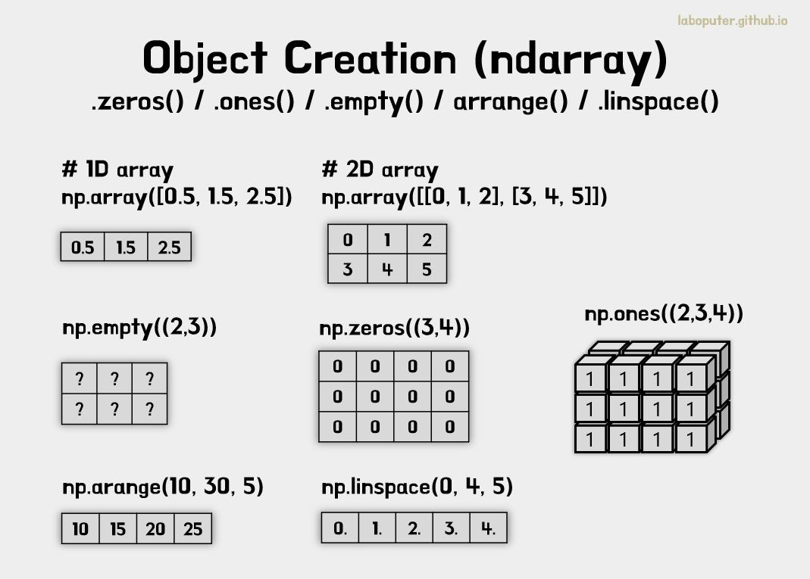

# Numpy

<br/>

-  넘파이(Numpy)는 Python에서 벡터, 행렬 등 수치 연산을 수행하는 선형대수(Linear algebra) 라이브러리입니다. 
- 선형대수 관련 수치 연산을 지원하고 내부적으로는 C로 구현되어 있어 연산이 빠른 속도로 수행됩니다. 
- 전반적으로 DBMS의 관계형 테이블 형태와 같은 표형태의 데이터로 이해 하면 편리합니다.

<br/><br/>

## 1. 기초 개념

<br/>

- Numpy에서 오브젝트는 단순히 다차원 배열로 표현한다.

- 모든 배열의 값이 기본적으로 같은 타입이어야 하며, 각 차원(Dimension)을 축(axis)이라고 표현한다.

- 3D Space의 포인트를 [1, 2, 1] 과 같은 배열로 표현가능 한데, 1개의 축을 가진다.

- 또한 여기서 축은 3개의 요소(Element)를 가지고 있다고 하며 길이(Length)도 3으로 표현된다.

<br/><br/>

## 1.1 기본 구조

<br/>

- 예를 들어, 아래와 같은 데이터는 2개의 축을 가지며, 1번째 축은 길이가 2, 2번째 축은 길이가 3이다.

```python
[[ 1, 0, 0],
 [ 0, 1, 2]]
```

<br/>

- Numpy에서 배열은 `ndarray` 또는 `array` 라고도 부른다.

- 예를 들어, 아래와 같이 (3, 5) 크기의 2D 배열을 생성할 수 있다.

```python
a= np.arange(15).reshape(3, 5)
print(a)
```

```python
[[ 0  1  2  3  4]
 [ 5  6  7  8  9]
 [10 11 12 13 14]]
```

<br/>

## 1.2 속성값 확인

<br/>

- `numpy` `ndarray` 의 대표적인 속성값들은 다음과 같다.

	- `ndarray.shape` : 배열의 각 축(axis)의 크기
   
	- `ndarray.ndim` : 축의 개수(Dimension)
   
	- `ndarray.dtype` : 각 요소(Element)의 타입
   
	- `ndarray.itemsize` : 각 요소(Element)의 타입의 bytes 크기
   
	- `ndarray.size` : 전체 요소(Element)의 개수

```python
print(a.shape)
```

```python
(3, 5)
```

```python
print(a.ndim)
```

```python
2
```

```python
print(a.dtype)
```

```python
int64
```

```python
print(a.itemsize)
```

```python
8
```

```python
print(a.size)
```

```python
15
```

```python
print(type(a))
```

```python
<class 'numpy.ndarray'>
```

<br/>


<br/><br/>

# 2. 배열 기본

<br/>

## 2.1 기본 배열 생성

<br/>

- `np.array()`를 이용하여 Python에서 사용하는 Tuple(튜플)이나 List(리스트)를 입력으로 numpy.ndarray 를 만들 수 있다.

```python
a= np.array([2,3,4])

print(a)
```

```python
[2 3 4]
```

```python
print(a.dtype)
```

```python
int64
```

```python
b= np.array([1.2, 3.5, 5.1])

print(b.dtype)
```

```python
float64
```

<br/>

- 자주 발생하는 실수로 아래와 같이 여러개의 입력하는 것이 아니라 연속된 데이터를 입력으로 주어야 한다.

```python
a= np.array(1,2,3,4)# WRONG
print(a)
```

```python
# ValueError: only 2 non-keyword arguments accepted
```

```python
a= np.array([1,2,3,4]) # RIGHT
print(a)
```

<br/>

- 2D 배열이나 3D 배열등도 마찬가지 방법으로 입력으로 주면 생성할 수 있다.

```python
b= np.array([(1.5,2,3), (4,5,6)])
print(b)
```

```python
[[1.5 2.  3. ]
[4.  5.  6. ]]
```

<br/>

- `dtype = complex`으로 복소수 값도 생성할 수 있다.

```python
c= np.array( [ [1,2], [3,4] ], dtype= complex)
print(c)
```

```python
[[1.+0.j 2.+0.j]
[3.+0.j 4.+0.j]]
```

<br/>

- 아래 코드를 이용하여 다양한 차원의 데이터를 쉽게 생성할 수 있다.

- `np.zeros(shape)` : 0으로 구성된 N차원 배열 생성
- `np.ones(shape)` : 1로 구성된 N차원 배열 생성
- `np.empty(shape)` : 초기화되지 않은 N차원 배열 생성

```python
# [3,4] 크기의 배열을 생성하여 0으로 채움
print(np.zeros((3,4)))
```

```python
[[0. 0. 0. 0.]
[0. 0. 0. 0.]
[0. 0. 0. 0.]]
```

```python
# [2,3,4] 크기의 배열을 생성하여 1로 채움
print(np.ones((2,3,4), dtype=np.int16))
```

```python
[[[1 1 1 1]
  [1 1 1 1]
  [1 1 1 1]]
  [[1 1 1 1]
  [1 1 1 1]
  [1 1 1 1]]]
```

```python
# 초기화 되지 않은 [2,3] 크기의 배열을 생성
print(np.empty((2,3)))
```

```python
[[1.39069238e-309 1.39069238e-309 1.39069238e-309]
 [1.39069238e-309 1.39069238e-309 1.39069238e-309]]
```

<br/>

- 아래 코드를 이용하여 연속적인 데이터도 쉽게 생성할 수 있다.

- `np.arange()`: N 만큼 차이나는 숫자 생성
- `np.linspace()`: N 등분한 숫자 생성

```python
# 10이상 30미만 까지 5씩 차이나게 생성
print(np.arange(10, 30, 5))
```

```python
[10 15 20 25]
```

```python
# 0이상 2미만 까지 0.3씩 차이나게 생성
print(np.arange(0, 2, 0.3))
```

```python
[0. 0.3 0.6 0.9 1.2 1.5 1.8]
```

```python
# 0~99까지 100등분
x= np.linspace(0, 99, 100)
print(x)
```

```python
[ 0.  1.  2.  3.  4.  5.  6.  7.  8.  9. 10. 11. 12. 13. 14. 15. 16. 17.
 18. 19. 20. 21. 22. 23. 24. 25. 26. 27. 28. 29. 30. 31. 32. 33. 34. 35.
 36. 37. 38. 39. 40. 41. 42. 43. 44. 45. 46. 47. 48. 49. 50. 51. 52. 53.
 54. 55. 56. 57. 58. 59. 60. 61. 62. 63. 64. 65. 66. 67. 68. 69. 70. 71.
 72. 73. 74. 75. 76. 77. 78. 79. 80. 81. 82. 83. 84. 85. 86. 87. 88. 89.
 90. 91. 92. 93. 94. 95. 96. 97. 98. 99.]
```

<br/>



<br/>

## 2.2 배열 출력하기

<br/>

- 1D와 2D 배열은 어떻게 출력되는지 살펴보았다. 그리고 3D 배열은 2차원이 N개 출력되는 형식으로 나타난다.

- 개인적인 이해 :  reshape(2,3,4) ⇒ 4콤마 3행 배열을 2개 만들어라

```python
a= np.arange(6)
print(a)
```

```python
[0 1 2 3 4 5]
```

```python
b= np.arange(12).reshape(4,3)
print(b)
```
```python
[[ 0  1  2]
 [ 3  4  5]
 [ 6  7  8]
 [ 9 10 11]]
```

```python
c= np.arange(24).reshape(2,3,4)
print(c)
```

```python
[[[ 0  1  2  3]
  [ 4  5  6  7]
  [ 8  9 10 11]]
  [[12 13 14 15]
  [16 17 18 19]
  [20 21 22 23]]]
```

<br/>

- `np.ndarray.reshape()`을 통해 데이터는 그대로 유지한 채 차원을 쉽게 변경한다.

```python
# [10000] 배열을 [100, 100] 배열로 변경
print(np.arange(10000).reshape(100,100))
```

```python
[   0    1    2 ... 9997 9998 9999]
[[   0    1    2 ...   97   98   99]
 [ 100  101  102 ...  197  198  199]
 [ 200  201  202 ...  297  298  299]
 ...
 [9700 9701 9702 ... 9797 9798 9799]
 [9800 9801 9802 ... 9897 9898 9899]
 [9900 9901 9902 ... 9997 9998 9999]]
```

<br/><br/>

## 2.3 배열 연산

<br/>

- numpy에서 수치연산은 기본적으로 element wise 연산이다. 숫자가 각각의 요소에 연산이 적용된다.

```python
a= np.array( [20,30,40,50] )
b= np.arange( 4 )

print(b)
```

```python
[0 1 2 3]
```

```python
# a에서 b에 각각의 원소를 -연산
c= a-b
print(c)
```

```python
[20 29 38 47]
```

```python
# b 각각의 원소에 제곱 연산
print(b**2)
```

```python
[0 1 4 9]
```

```python
# a 각각의 원소에 *10 연산
print(10*np.sin(a))
```

```python
[ 9.12945251 -9.88031624  7.4511316  -2.62374854]
```

```python
# a 각각의 원소가 35보다 작은지 Boolean 결과
print(a<35)
```

```python
[ True  True False False]
```

<br/>

- 2차원 배열을 행렬이라고 생각했을 때 행렬의 여러가지 곱셈이 있다.

- `*` : 각각의 원소끼리 곱셈 (Elementwise product, Hadamard product)
- `@` : 행렬 곱셈 (Matrix product)
- `.dot()` : 행렬 내적 (dot product)

```python
A= np.array( [[1,1],
               [0,1]] )

B= np.array( [[2,0],
               [3,4]] )

print(A * B)
```

```python
[[2 0]
 [0 4]]
```

```python
print(A @ B)
```

```python
[[5 4]
 [3 4]]
```

```python
print(A.dot(B))
```

```python
[[5 4]
 [3 4]]
```

<br/>

- 수치연산 진행할 때 각각의 `.dtype`이 다르면 타입이 큰쪽(int < float < complex)으로 자동으로 변경된다.

```python
a= np.ones(3, dtype=np.int32)
b= np.linspace(0, np.pi,3)
print(b.dtype.name)
```

```python
float64
```

```python
# a(int), b(float) 연산 시 float로 upcasting
c= a+b
print(c)
```

```python
[1.         2.57079633 4.14159265]
```

```python
print(c.dtype.name)
```

```python
float64
```

```python
# 마찬가지로 복소수 연산 시 complex(복소수)로 upcasting
d= np.exp(c*1j)
print(d)
```

```python
[ 0.54030231+0.84147098j -0.84147098+0.54030231j -0.54030231-0.84147098j]
```

```python
print(d.dtype.name)
```

```python
complex128
```

<br/>

- 아래 코드와 같은 연산을 진행할 수 있다.

- `.sum()`: 모든 요소의 합
- `.min()`: 모든 요소 중 최소값
- `.max()`: 모든 요소 중 최대값
- `.argmax()`: 모든 요소 중 최대값의 인덱스
- `.cumsum()`: 모든 요소의 누적합

```python
a= np.arange(8).reshape(2, 4)**2
print(a)
```

```python
[[ 0  1  4  9]
 [16 25 36 49]]
```

```python
# 모든 요소의 합
print(a.sum())
```

```python
140
```

```python
# 모든 요소 중 최소값
print(a.min())
```

```python
0
```

```python
# 모든 요소 중 최대값
print(a.max())
```

```python
49
```

```python
# 모든 요소 중 최대값의 인덱스
print(a.argmax())
```

```python
7
```

```python
# 모든 요소의 누적합
print(a.cumsum())
```

```python
[  0   1   5  14  30  55  91 140]
```

<br/>

- `.sum()`, `.min()`, `.max()`, `.cumsum()`과 같은 연산에 axis 값을 입력하면 축을 기준으로도 연산할 수 있다. 

- `axis=0`은 `shape`에서 첫번째부터 순서대로 해당된다.

```python
b= np.arange(12).reshape(3,4)
print(b)
```

```python
[[ 0  1  2  3]
 [ 4  5  6  7]
 [ 8  9 10 11]]
```

```python
print(b.sum(axis=0))
```

```python
[12 15 18 21]
```

```python
print(b.sum(axis=1))
```

```python
[ 6 22 38]
```

<br/>


<br/>

<br/><br/>

## 2.4 배열 인덱싱

<br/>

- Numpy에서 인덱싱과 슬라이싱에 대한 개념은 Python과 기본적으로 동일하다.

```python
a= np.arange(10)**3
print(a)
```

```python
[  0   1   8  27  64 125 216 343 512 729]
```

```python
print(a[2])
```

```python
8
```

```python
# 2~4번 인덱스
print(a[2:5])
```

```python
[ 8 27 64]
```

```python
# 0~5번에서 2Step 인덱스
a[:6:2]= 1000
print(a)
```

```python
[1000    1 1000   27 1000  125  216  343  512  729]
```

```python
# reverse
a[ : :-1]
for iin a:
print(i**(1/3.))
```

```python
9.999999999999998
1.0
9.999999999999998
3.0
9.999999999999998
4.999999999999999
5.999999999999999
6.999999999999999
7.999999999999999
8.999999999999998
```

<br/>

`np.fromfunction()`을 통해 인덱스 번호를 가지고 함수를 정의해 생성할 수도 있다.

```python
deff(x,y):
return 10*x+y

b= np.fromfunction(f, (5,4), dtype=int)
print(b)
```

```python
[[ 0  1  2  3]
 [10 11 12 13]
 [20 21 22 23]
 [30 31 32 33]
 [40 41 42 43]]

print(b[2,3])
```

```python
23
```

```python
print(b[0:5, 1])
```

```python
[ 1 11 21 31 41]
```

```python
print(b[ : ,1])
```

```python
[ 1 11 21 31 41]
```

```python
print(b[1:3, : ])
```

```python
[[10 11 12 13]
 [20 21 22 23]]
```

```python
print(b[-1])
```

```python
[40 41 42 43]
```

<br/>

- `...`은 차원이 너무 많을 때 실수를 줄여줄 수 있습니다. 만약 x가 5차원이라고 할 때 아래 처럼 표현할 수 있다.

- x[1, 2, …] 는 x[1, 2, :, :, :] 와 같다.
- x[…, 3] 는 x[:, :, :, :, 3] 와 같다.
- x[4, …, 5, :] 는 x[4, :, :, 5, :] 와 같다.

```python
# a 3D array (two stacked 2D arrays)
c= np.array( [[[  0,  1,  2],
                [ 10, 12, 13]],
               [[100,101,102],
                [110,112,113]]])

print(c.shape)
```

```python
(2, 2, 3)
```

```python
print(c[1,...])# same as c[1,:,:] or c[1]
```

```python
[[100 101 102]
 [110 112 113]]
```

```python
print(c[...,2])# same as c[:,:,2]
```

```python
[[  2  13]
 [102 113]]
```

<br/>

- 다차원의 배열을 for문을 적용하면 axis=0 기준으로 적용된다. 

- 만약 다차원 배열의 모든 원소를 for문 적용하고 싶은 경우 `.reshape()`을 해도 되지만, `.flat`을 이용할 수 있다.

```python
for row in b:
    print(row)
```

```python
> *[0 1 2 3]
  [10 11 12 13]
  [20 21 22 23]
  [30 31 32 33]
  [40 41 42 43]*
```

```python
for element in b.flat:
    print(element)
```

```python
*0
 1
 2
 3
 10
 11
 12
 13
 20
 21
 22
 23
 30
 31
 32
 33
 40
 41
 42
 43*
```

<br/>

## 2.5 Shape 변경

- `np.ndarray`의 shape를 다양한 방법으로 변경할 수 있다. 

- `.ravel()`은 1차원으로, `.reshape()`는 지정한 차원으로, `.T`는 전치(Transpose) 변환을 할 수 있다. 

- 하지만 데이터 원본은 변경시키지 않고 복사하여 연산한 결과가 return 된다.

```python
a = np.floor(10*npr.random((3,4)))

print(a)
```

```python
*[[8. 0. 0. 6.]
  [1. 4. 3. 0.]
  [0. 3. 1. 9.]]*
```

```python
print(a.shape)
```

```python
*(3, 4)
```

```python
# 모든 원소를 1차원으로 변경*
print(a.ravel())
```

```python
*[8. 0. 0. 6. 1. 4. 3. 0. 0. 3. 1. 9.]
```

```python
# [3,4] => [2,6]로 변경*
print(a.reshape(2,6))
```

```python
*[[8. 0. 0. 6. 1. 4.]
  [3. 0. 0. 3. 1. 9.]]
```

```python
# [3,4]의 전치(transpose)변환으로 [4,3]*
print(a.T)
```

```python
*[[8. 1. 0.]
  [0. 4. 3.]
  [0. 3. 1.]
  [6. 0. 9.]]*
```

```python
print(a.T.shape)
```

```python
*(4, 3)*
```

```python
print(a.shape)
```

```python
*(3, 4)*
```

<br/>

<br/>


<br/>

<br/>

- `.resize()`는 위의 `.reshape()`와 동일한 기능이지만 원본 데이터 자체를 변경시킨다. 

- `.reshape()`를 할 때 차원값에 -1를 입력하면 -1 부분은 자동으로 차원을 채워준다. 

- 당연히 여러 차원에서 -1는 하나만 사용할 수 있고 나머지가 지정된 결과를 바탕으로 자동으로 계산해준다

```python
print(a)
```

```python
*[[8. 0. 0. 6.]
  [1. 4. 3. 0.]
  [0. 3. 1. 9.]]*
```

```python
a.resize((2,6))
print(a)
```

```python
*[[8. 0. 0. 6. 1. 4.]
  [3. 0. 0. 3. 1. 9.]]*
```

```python
print(a.reshape(3,-1))
```

```python
*[[8. 0. 0. 6.]
  [1. 4. 3. 0.]
  [0. 3. 1. 9.]]*
```

<br/><br/>

## 2.6 데이터 쌓기

<br/>

- `np.vstack()` 와 `np.hstack()`를 통해 데이터를 합칠 수 있다.

	- `np.vstack()`: axis=0 기준으로 쌓음
	- `np.hstack()`: axis=1 기준으로 쌓음

```python
a = np.floor(10*npr.random((2,2)))
print(a)
```

```python
*[[1. 4.]
  [2. 4.]]*
```

```python
b = np.floor(10*npr.random((2,2)))
print(b)
```

```python
*[[3. 7.]
  [3. 7.]]
```

```python
# [2,2] => [4,2]*
print(np.vstack((a,b)))
```

```python
*[[1. 4.]
  [2. 4.]
  [3. 7.]
  [3. 7.]]
```

```python
# [2,2] => [2,4]*
print(np.hstack((a,b)))
```

```python
*[[1. 4. 3. 7.]
  [2. 4. 3. 7.]]*
```

<br/><br/>

## 2.7 데이터 쪼개기

<br/>

- `np.hsplit()`을 통해 숫자1개가 들어갈 경우 X개로 등분, 리스트로 넣을 경우 axis=1 기준 인덱스로 데이터를 분할할 수 있습니다.

```python
a = np.floor(10*npr.random((2,12)))
print(a)
```

```python
*[[4. 4. 1. 7. 7. 8. 8. 8. 4. 3. 5. 3.]
  [9. 8. 7. 5. 6. 8. 9. 6. 9. 5. 4. 7.]]
```

```python
# [2,12] => [2,4] 데이터 3개로 등분*
print(np.hsplit(a, 3))
```

```python
*[array([[4., 4., 1., 7.],
        [9., 8., 7., 5.]]), array([[7., 8., 8., 8.],
        [6., 8., 9., 6.]]), array([[4., 3., 5., 3.],
        [9., 5., 4., 7.]])]
```

```python
# [2,12] => [:, :3], [:, 3:4], [:, 4:]로 분할*
print(np.hsplit(a, (3,4)))
```

```python
*[array([[4., 4., 1.],
         [9., 8., 7.]]), array([[7.],
         [5.]]), array([[7., 8., 8., 8., 4., 3., 5., 3.],
         [6., 8., 9., 6., 9., 5., 4., 7.]])]*
```

<br/><br/>

## 2.8 데이터 복사

<br/>

- [복사되지 않는 경우] - No Copy at All

- 아래와 같이 `np.array`를 변수에 넣는다고 해서 복사가 되지 않는다. 레퍼런스를 참조할 뿐이다. 

- `id()`를 통해 주소값을 반환해서 확인할 수 있습니다.

```python
a = np.array([[ 0,  1,  2,  3],
              [ 4,  5,  6,  7],
              [ 8,  9, 10, 11]])

*# 두 개가 사실상 같다. (복사가 아님)*
```

```python
b = a

print(b is a)
```

```python
*True*
```

```python
print(id(a))
```

```python
*140389588429040*
```

```python
print(id(b))
```

```python
*140389588429040*
```

<br/>

- [ 얕은복사 ] - View or Shallow Copy

- `view()`를 통해 Shallow Copy를 할 수 있다. 

- Numpy 관점에서 view()는 실제로 데이터가 복사된다기 보다는 데이터 각각의 참조값이 복사된다. 

- c와 a의 참조값은 다르지만 각각의 데이터 참조값이 복사됐다는 의미이다.

- 따라서 a와 c는 다르지만 c[0, 4]는 a[0, 4]는 같은 참조값을 보고 있어 a가 변경되는 것을 확인할 수 있다. 

- 마찬가지로 s에 a를 슬라이싱하여 데이터를 가져가도 s를 변경하면 a가 변경된다.

```python
c = a.view()

*# c와 a의 참조값은 다름*
print(c is a)
```

```python
*False*
```

```python
c = c.reshape((2, 6))
print(a.shape)
```

```python
*(3, 4)
```

```python
# c의 데이터와 a의 데이터의 참조값은 같음*
c[0, 4] = 1234
print(a)
```

```python
*[[   0    1    2    3]
  [1234    5    6    7]
  [   8    9   10   11]]
```

```python
# a를 슬라이싱해도 데이터의 참조값은 같음*
s = a[ : , 1:3]
s[:] = 10
print(a)
```

```python
*[[   0   10   10    3]
  [1234   10   10    7]
  [   8   10   10   11]]*
```

<br/>

- [ 깊은복사 ] - Deep copy

- `.copy()`를 이용하면 Deep Copy를 할 수 있다. 즉 a와 d의 참조값 뿐만 아니라 a의 각각의 데이터 전부가 새로운 객체로 생성된다.

```python
d = a.copy()

*# a와 d의 참조값은 다름*
print(d is a)
```

```python
*False
```

```python
# a와 d의 데이터의 참조값도 다름*
d[0,0] = 9999
print(a)
```

```python
*[[   0   10   10    3]
  [1234   10   10    7]
  [   8   10   10   11]]*
```

<br/>

- Python의 `del` 키워드를 이용하면 메모리를 반환할 수 있다.

```python
a = np.arange(int(1e8))
b = a[:100].copy()
del a 
print(a)
```

```python
> NameError                                 Traceback (most recent call last)
  <ipython-input-32-2dcfdd85bd07> in <module>()
        2 b = a[:100].copy()
        3 del a
  ----> 4 print(a)
  NameError: name 'a' is not defined*
```

<br/><br/>

## 3. Broadcasting rules

<br/>

- Numpy에서 Broadcasting(브로드캐스팅)은 반드시 이해하고 있어야 하는 개념이다. 

- 브로드 캐스팅은 편리성을 위해 Shape가 다른 `np.narray` 끼리 연산을 지원해준다. 

- 데이터 계산 시 자주 등장하는 상황인데, 이것이 없다면 Shape를 맞춰야하는 번거로움이 생기게 된다.

- 웬만하면 Shape를 같게 맞춘 후에 연산하는 것이 바람직하다는 것을 명심하고 대안으로 학습을 진행한다.

```python
np.array([1,2,3,4,5]) * 2
```

```python
[2,4,6,8,10]*
```

<br/>

- 일반적인 Python List였으면 값이 10개인 배열이 생성되지만, 

- 이렇게 계산되는 이유는 Numpy의 브로드 캐스팅의 결과로 내부적으로 아래 변환되어 계산된다.

```python
np.array([1,2,3,4,5]) * 2 

*# Broadcasting*
np.array([1,2,3,4,5]) * np.array([2,2,2,2,2])
```

<br/>

- 우선 차원(ndim)이 같고 각 축(axis)의 값이 같거나 1이야 연산이 가능하다. 

- 만약 각 축의 값이 다르면 브로드캐스팅되어 값이 복사된다. 아래 코드 및 그림을 예시로 든다.

```python
print(np.arange(4) * 2)
```

```python
*[0 2 4 6]*
```

```python
print(np.ones((3,4)) * np.arange(4))
```

```python
*[[0. 1. 2. 3.]
  [0. 1. 2. 3.]
  [0. 1. 2. 3.]]*
```

```python
print(np.arange(3).reshape((3,1)) * np.arange(3))
```

```python
*[[0 0 0]
  [0 1 2]
  [0 2 4]]*
```

<br/>


<br/>

## 4. Indexing

<br/>

## 4.1 인덱스 배열로 인덱싱하기

<br/>

- 인덱스를 가진 배열로 인덱싱을 할 수 있다.

```python
a = np.arange(12)**2
print(a)
```

```python
*[  0   1   4   9  16  25  36  49  64  81 100 121]*
```

```python
i = np.array([1, 1, 3, 8, 5])
print(a[i])
```

```python
*[ 1  1  9 64 25]*
```

```python
j = np.array([[3, 4], [9, 7]])
print(a[j])
```

```python
*[[ 9 16]
  [81 49]]*
```

<br/>


<br/>

- 그림을 이해하셨으면 아래 인덱싱 코드들을 설명할 줄 알아야 한다.

```python
palette = np.array([[0, 0, 0],         *# black*
                    [255, 0, 0],       *# red*
                    [0, 255, 0],       *# green*
                    [0, 0, 255],       *# blue*
                    [255, 255, 255]])  *# white*

image = np.array([[0, 1, 2, 0],
                  [0, 3, 4, 0]])

palette[image]
```

```python
*array([[[  0,   0,   0],
         [255,   0,   0],
         [  0, 255,   0],
         [  0,   0,   0]],
        [[  0,   0,   0],
         [  0,   0, 255],
         [255, 255, 255],
         [  0,   0,   0]]])*
```

```python
a = np.arange(5)
print(a)
```

```python
*[0 1 2 3 4]*
```

```python
a[[1,3,4]] = 0
print(a)
```

```python
*[0 0 2 0 0]*
```

```python
a = np.arange(5)
print(a)
```

```python
*[0 1 2 3 4]*
```

```python
a[[0,0,2]] += 1
print(a)
```

```python
*[1 1 3 3 4]*
```

<br/><br/>

## 4.2 Bool로 인덱싱하기

<br/>

- Bool 타입을 가진 값들로도 인덱싱이 가능하다.

```python
a = np.arange(12).reshape(3,4)
b = a > 4

print(b)
```

```python
*[[False False False False]
  [False  True  True  True]
  [ True  True  True  True]]*

print(a[b])
```

```python
*[ 5  6  7  8  9 10 11]*
```

```python
a[b] = 0
print(a)
```

```python
*[[0 1 2 3]
  [4 0 0 0]
  [0 0 0 0]]*
```

<br/>


<br/>

## 4.3 The ix_() function

- `.ix_()`을 통해 서로 다른 Shape를 가진 배열들을 묶어서 처리할 수 있다.

```python
a = np.array([2,3,4,5])
b = np.array([8,5,4])
c = np.array([5,4,6,8,3])

ax,bx,cx = np.ix_(a,b,c)
print(ax)
```

```python
*[[[2]]
  [[3]]
  [[4]]
  [[5]]]*
```

```python
print(bx)
```

```python
*[[[8]
   [5]
   [4]]]*
```

```python
print(cx)
```

```python
*[[[5 4 6 8 3]]]*
```

```python
print(ax.shape, bx.shape, cx.shape)
```

```python
*(4, 1, 1) (1, 3, 1) (1, 1, 5)*
```

```python
result = ax+bx*cx
print(result)
```

```python
*[[[42 34 50 66 26]
   [27 22 32 42 17]
   [22 18 26 34 14]]
  [[43 35 51 67 27]
   [28 23 33 43 18]
   [23 19 27 35 15]]
  [[44 36 52 68 28]
   [29 24 34 44 19]
   [24 20 28 36 16]]
  [[45 37 53 69 29]
   [30 25 35 45 20]
   [25 21 29 37 17]]]*
```

```python
print(result[3,2,4])
```

```python
*17*
```

```python
print(a[3]+b[2]*c[4])
```

```python
*17*
```
