# 머신러닝 모델 기초

 

## 머신러닝의 대표적인 적용 사례

 

- 이미지 분류 : 제품 생산 시 제품의 이미지를 분석해 자동으로 분류하는 시스템

- 시맨틱 분할 : 인간의 뇌를 스캔하여 종양 여부의 진단

- 텍스트 분류(자연어 처리) : 자동으로 뉴스, 블로그 등의 게시글 분류

- 텍스트 분류 : 토론 또는 사이트 등에서의 부정적인 코멘트를 자동으로 구분

- 텍스트 요약 : 긴 문서를 자동으로 요약하여 요점 정리

- 자연어 이해 : 챗봇(chatbot) 또는 인공지능 비서 만들기

- 회귀 분석 : 회사의 내년도 수익 예측

- 음성 인식 : 음성 명령에 반응하는 프로그램

- 이상치 탐지 : 신용 카드 부정 거래 감지

- 군집 작업 : 구매 이력을 기반으로 고객 분류 후 서로 다른 마케팅 전략 계획

- 데이터 시각화 : 고차원의 복잡한 데이터셋을 그래프와 같은 효율적인 시각 표현

- 추천 시스템 : 과거 구매이력, 관심 상품, 찜 목록 등을 분석하여 상품 추천

- 강화 학습 : 지능형 게임 봇 만들기

  

## 머신러닝 시스템 분류

 

1. 훈련 지도 여부 : 지도 학습, 비지도 학습, 준지도 학습, 강화 학습

2. 실시간 훈련 여부 : 온라인 학습, 배치 학습

3. 예측 모델 사용 여부 : 사례 기반 학습, 모델 기반 학습

- 단, 분류 기준은 상호 배타적이지 않아 하나의 모델이 세 가지 기준을 모두 충족할 수도 있다. : 비배타성

 

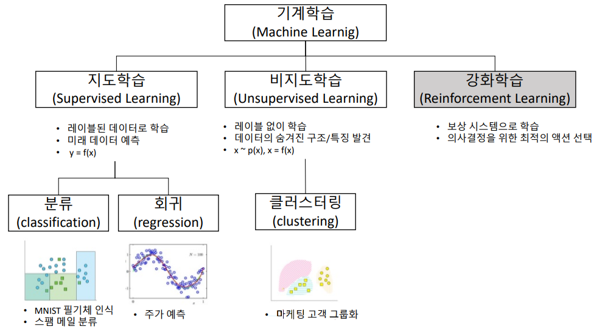

 

## 1.1 지도학습

 

- 훈련 데이터에 레이블(label) 또는 타깃(garget)이라는 정답지가 포함된 데이터

- 훈련 데이터로부터 하나의 함수를 유추해내기 위한 방법

- 사전 정답지로부터 유추된 함수 중 연속적인 값을 출력하면 회귀분석, 어떤 종류의 값인지 표시하는 것을 분류라고 한다.

 

**[지도학습에 사용되는 알고리즘]**

- k-최근접 이웃(kNN : k-Nearest Neighbors)

- 선형 회귀(linear regression)

- 로지스틱 회귀(logistic regression)

- 서포트 벡터 머신(SVC : support vector machines)

- 결정 트리(decision trees)

- 랜덤 포레스트(randome forests)

- 신경망(neural networks)

  

## ① 분류(classification)

 

- 분류는 전형적인 지도 학습 작업 중 하나로 스팸 필터 프로그램이 예를 들 수 있다.

- 스팸 필터 프로그램은 여러 가지 메일과 발송 기관 등을 샘플로 훈련하며 스팸메일인지 아닌지를 분류할 수 있도록 훈련되어야 한다.

 

- 분류 : 어떠한 데이터가 어느 범주에 속하는지 알맞게 분류하는 것, 따라서 연속형 변수를 타겟변수로 가져야 한다.

- 대표적인 머신러닝 모델 : 로지스틱 회귀분석, 분류나무, KNN 등

- 성능 평가 지표 : 정확도(Accuracy), 재현율(Recall), 정밀도(Precision), F1-Score 등

 

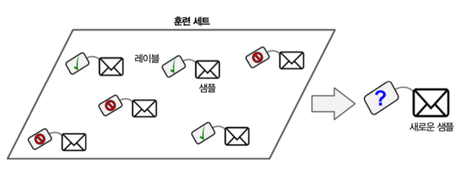

  

## ② 회귀(regression)

 

- 회귀는 여러 가지 특성을 사용하여 타깃의 수치를 예측하는 방법 중고차 가격 예측을 예로 들 수 있다.

- 중고차 가격을 예측하기 위해 사용되는 특성에는 주행거리, 연식, 브랜드 등을 사용하며 타깃은 중고차의 가격이 되어 타깃을 예측한다.

- 회귀 방법을 사용하기 위해서는 예측 가능한 변수와 레이블이 포함된 대량의 중고차 판매 데이터가 필요하다.

 

- 회귀 / 예측 : 어떠한 데이터가 어떠한 값을 가지는지에 대해 예측하는 것, 따라서 분류는 범주형 변수를 타겟변수로 가져야 한다.

- 대표적인 머신러닝 모델 : 회귀분석, 회귀나무

- 성능 평가 지표 : MSE, RMSE, MAPE

 

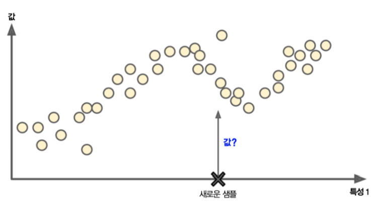

  

## 1.2 비지도 학습

 

- 비지도 학습은 레이블이 없는 훈련 데이터를 이용하여 시스템이 스스로 학습을 하도록 하는 학습 방법

- 지도 학습, 강화 학습과는 달리 입력 값에 대한 목표치가 주어지지 않는다.

- 비지도 학습의 대표적인 예로는 군집, 시각화와 차원 축소, 연관 규칙 학습 등이 있다.

 

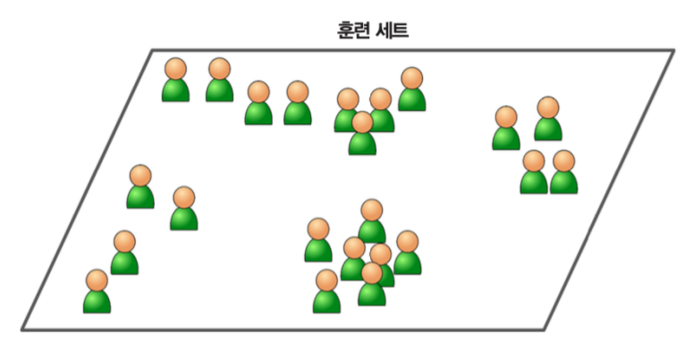

  

## ① 군집

 

- 군집은 데이터를 비슷한 특징을 가진 몇 개의 그룹으로 나누는 것으로 블로그 방문자들을 그룹으로 묶는 것을 예로 들 수 있다.

- 어떤 블로그에 방문자들을 성별, 날짜, 연령대, 게시글 카테고리 등으로 그룹화하는 것을 뜻한다.

- 군집의 대표적인 알고리즘에는 k-평균, DBSCAN, 계층 군집 분석 등이 있다.

 

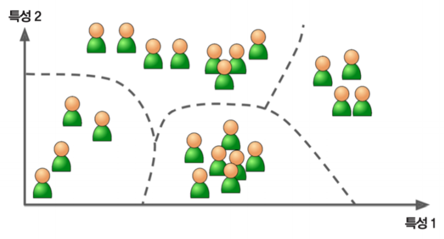

  

## ② 시각화와 차원축소

 

- 시각화는 레이블이 없는 다차원 특성을 가진 데이터셋을 2D 또는 3D로 표현하는 것

- 시각화를 하기 위해서는 데이터 특성을 두 가지로 줄여야 한다.

- 시각화된 데이터는 구성 패턴을 통해 어떻게 조직되어 있는지 이해할 수 있게 되고 이상치 패턴들을 발견하여 잘못된 정보를 분석할 수 있게 된다.

  

- 차원 축소는 데이터의 특성 수를 줄이는 것으로 상관관계가 있는 여러 특성을 하나로 합치는 과정

- 이를 특성 추출이라 하며 예를 들어 자동차의 주행거리와 연식은 상관관계가 높아 자동차의 '마모 정도'라는 하나의 특성으로 합칠 수 있다.

- 차원 축소를 통해 머신러닝 알고리즘의 성능을 향상할 수 있고, 훈련 실행 속도가 빨라지는 등 메모리 사용 공간이 줄어드는 장점이 있다.

 

- 시각화와 차원 축소의 알고리즘으로는 주성분 분석(PCA), 커널 PCA, 지역적 선형 임베딩, t-SNE 등이 있다.

 

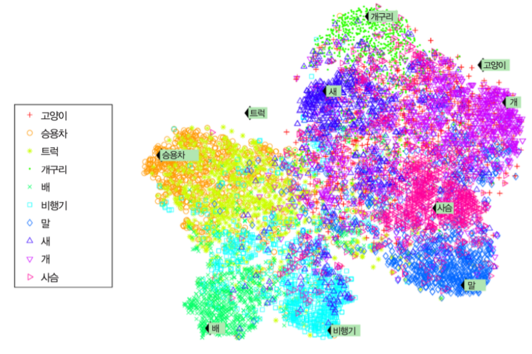

  

## ③ 이상치 탐지(Outlier detection)와 특이치 탐지(Novelty detection)

 

- 이상치 탐지는 정상 샘플을 이용하여 훈련 후 입력 샘플의 정상여부를 판단하여 이상치를 추출하거나 자동으로 제거하는 것

- 신용 카드의 부정거래를 감지하거나 제조업에서 제품 결함을 잡아내는 것을 예로 들 수 있다.

- 새로운 치와와 사진을 다른 강아지들과 비교하여 다른 종으로 간주할 수 있다.

 
 
- 특이치 탐지는 전혀 오염되지 않은 훈련 세트를 활용한 뒤 훈련 세트에 포함된 데이터와 달라 보이는 데이터를 감지하는 것

- 특이치 탐지 알고리즘은 새로운 치와와 사진을 특이치로 간주하지 않는다.
 

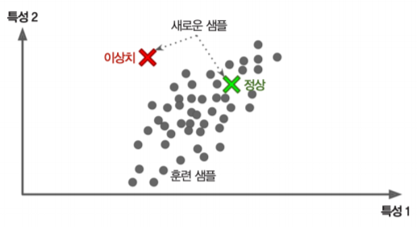

  

## ④ 연관 규칙 학습

 

- 연관 규칙 학습은 데이터 특성 간의 흥미로운 관계를 찾는 것으로 마트 판매 기록을 예로 들 수 있다.

- 예를 들어 연관 규칙 학습을 통해 바비큐 소스와 감자 구매와 스테이크 구매 사이의 연관성이 밝혀지게 된다면 이들을 가까운 진열대에 진열할 수 있도록 하는 것

- 즉, 서로 다른 데이터의 연관성을 찾을 때 사용한다.

 

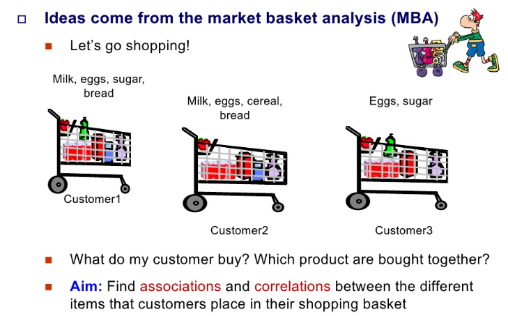

  

## 1.3 준지도 학습

 

- 준지도 학습은 레이블이 적용된 적은 수의 샘플이 주어졌을 때 유용한 방법

- 비지도 학습을 통해 군집을 분류한 후 샘플들을 활용해 지도 학습을 실행하는 것

- 대부분 머신러닝을 사용할 때 지도 학습과 비지도 학습을 혼합하여 사용하고 있다. 
 
- 준지도 학습의 좋은 예로 구글 포토 호스팅을 들 수 있다.

- 가족사진 몇 장에만 레이블을 적용하여 이후 모든 사진에서 가족사진을 확인 가능하도록 한다.

 

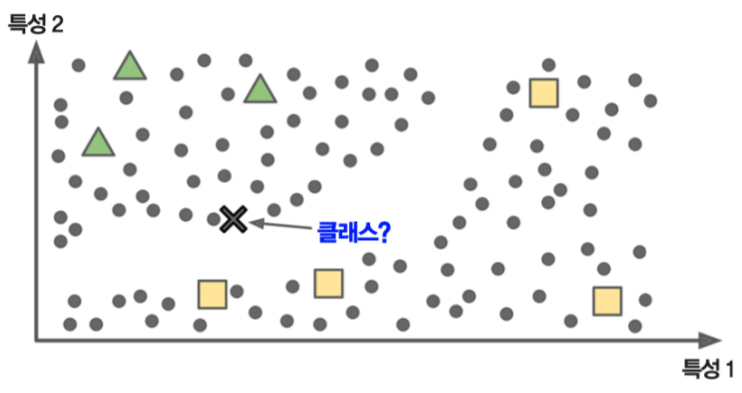

  

## 1.4 강화 학습

 

- 강화 학습은 학습 시스템이 취한 행동에 대해 보상 또는 벌점을 주어 가장 큰 보상을 받는 방향으로 유도하는 방법

- 여기서 가장 큰 보상을 얻기 위해 시스템이 해야 할 행동을 선택하는 방법을 정의하게 되는데 이를 정책이라고 한다.

- 강화 학습에는 딥마인드의 알파고를 예로 들 수 있다.

 

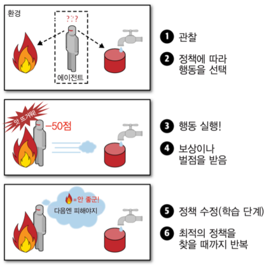

  

## 2. 실시간 훈련 여부 구분

  

## 2.1 배치 학습(Batch Learning)

 

- 배치 학습은 주어진 훈련 세트 전체를 사용하기 때문에 오프라인 환경에서 적합하여 오프라인 학습이라고도 한다.

- 먼저, 시스템을 훈련시킨 후 더 이상의 학습 없이 제품 시스템에 적용한다.

- 하지만 이는 컴퓨팅 자원(CPU, GPU, 저장장치 등)이 충분한 환경에서만 사용이 가능하며, 새로운 데이터가 들어오면 처음부터 새롭게 학습해야 하는 단점이 있다.

- 하지만, 이를 해결하기 위해 MLOps 등을 이용한 자동화 기능을 사용하고 있으며, 이후 이전 시스템의 사용을 중지하고 새로운 시스템으로 교체하는 방식으로 사용한다.

 

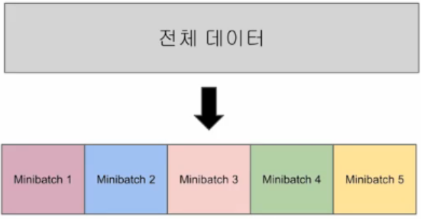

  

## 2.2 온라인 학습(Online Learning)

 

- 온라인 학습은 하나씩 또는 적은 양의 데이터인 미니 배치(mini-batch)를 사용하여 점진적으로 훈련을 하는 방법

- 미니 배치 단위로 학습을 하기 때문에 일반적인 배치 학습에 비해 적은 양의 자원을 사용한다.

- 하지만 나쁜 데이터가 주입되는 경우 시스템 성능이 점진적으로 떨어질 수 있기 때문에 지속적인 시스템 모니터링이 필요하다.

- 온라인 학습의 예로 주식 가격 시스템 등 실시간 반영이 중요한 시스템을 예로 들 수 있다.

- 스마트폰 등 제한된 자원의 시스템, 외부 메모리 학습(매우 큰 데이터셋을 활용하는 시스템) 등에도 활용되고 있다.

- 온라인 학습은 변화하는 데이터에 얼마나 빠르게 적응할 것인지가 중요하며 이를 학습률(Learning rate)이라고 한다.

 

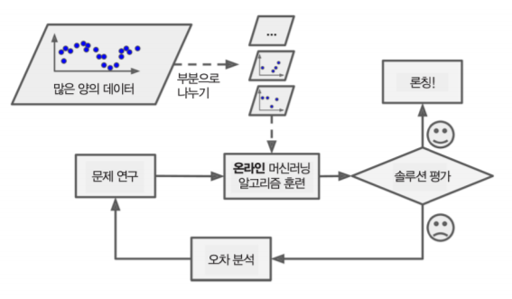

  

## 3. 예측 모델 사용 여부 구분

 

- 예측 모델 사용 여부는 훈련 모델의 일반화(Generalization) 방식에 따른 분류를 하며, 일반화란 새로운 데이터에 대한 예측을 뜻한다.

  

## 3.1 사례기반 학습

 

- 사례 기반 학습은 샘플을 기억하는 것이 훈련의 전부이며 예측을 위해 기존 샘플과의 유사도를 측정한다.

- 사례 기반 학습의 예로 k-최근접 이웃(k-NN: k-Nearest Neighbors) 알고리즘을 들 수 있다.

- 아래 사진을 보면, 새로운 샘플인 X가 기존에 세모인 샘플, 네모인 샘플과의 유사도를 측정하여 유사도가 높은 도형으로 분류한다.

- 위 사진의 경우 새로운 샘플은 세모인 샘플과의 유사도가 더 높게 측정되므로 세모로 분류된다.

 

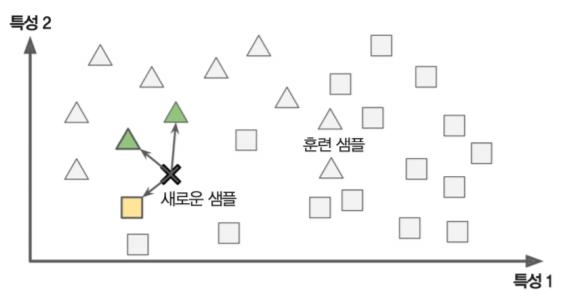

  

## 3.2 모델기반 학습

 

- 모델 기반 학습은 모델을 미리 지정한 후 훈련 세트를 사용해서 모델을 훈련시키는 것

- 훈련된 모델을 사용해 새로운 데이터에 대한 예측을 할 수 있으며 앞으로 다룰 대부분의 분석 알고리즘이 모델 기반 학습이다.

- 아래 사진을 예로 새로운 샘플에 대하여 데이터를 분류하는 방법이다.

- 새로운 샘플 X는 모델을 나타내는 점선에 의해 세모에 분류되는 것을 알 수 있다.

 

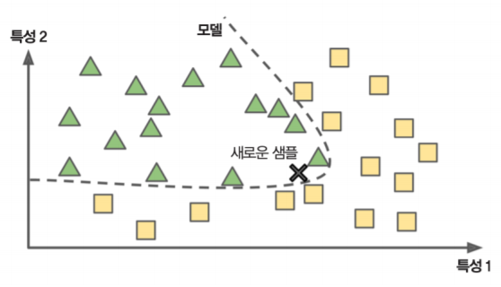
