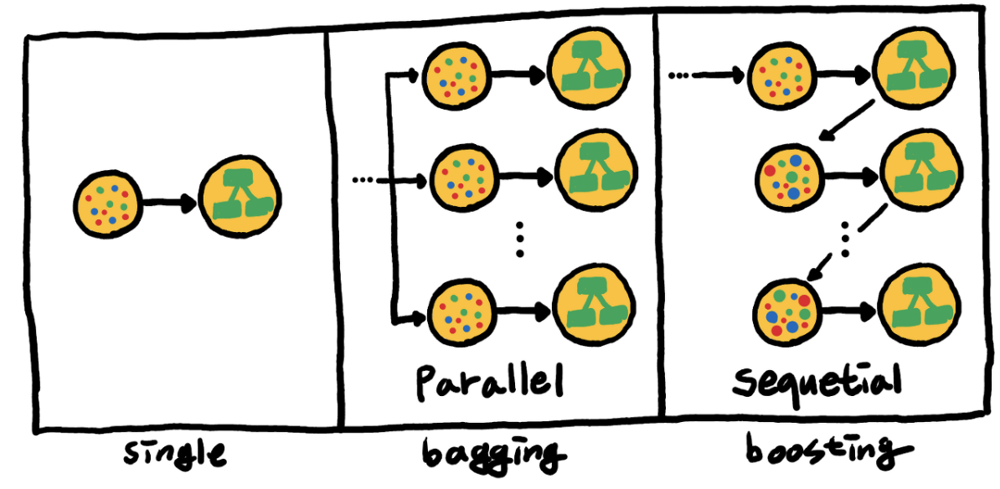
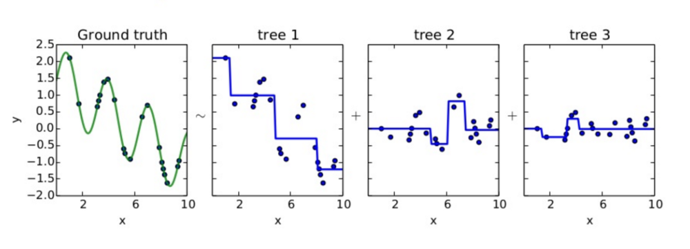
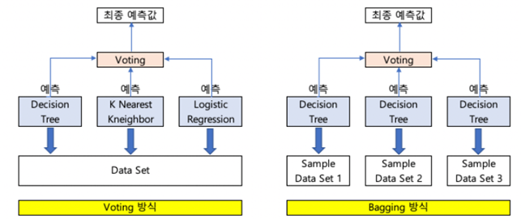
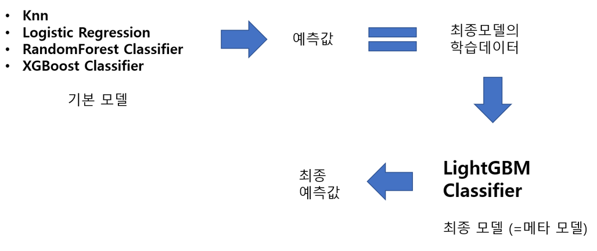
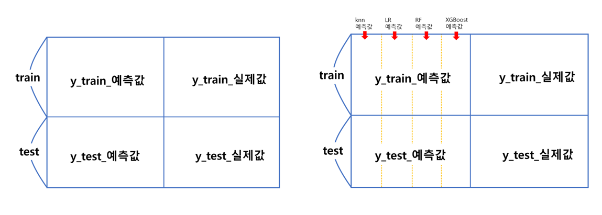
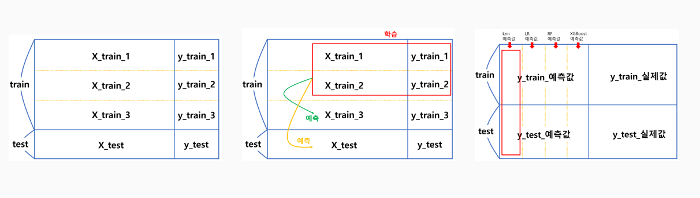
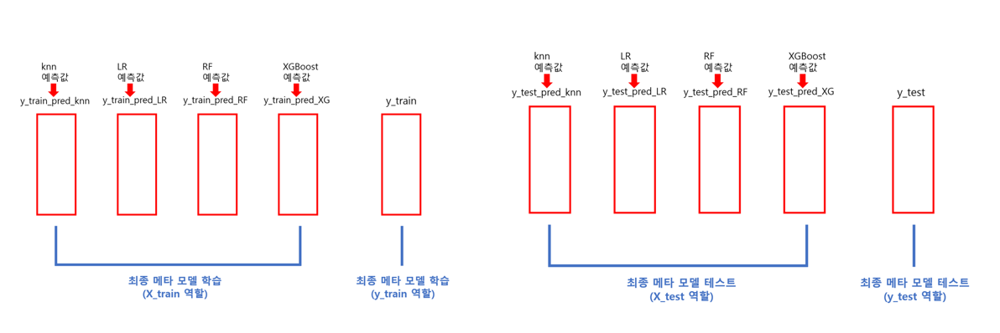
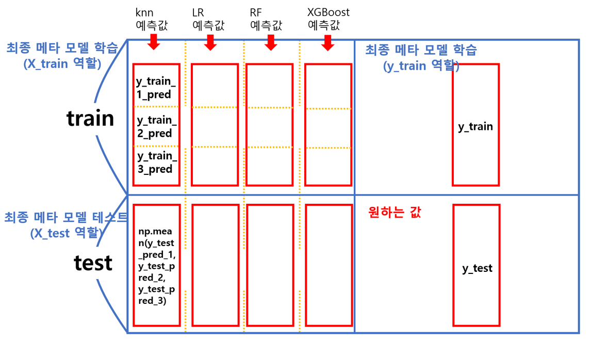

## Bagging, Boosting, Voting, Stacking

 

## 모델 정의

 

- 앙상블은 여러 개의 의사 결정 트리(Decision Tree)를 결합하여 하나의 결정 트리보다 더 좋은 성능을 내는 머신러닝 기법이다.

- 앙상블 학습의 핵심은, 여러 개의 약 분류기(Weak Classifier)를 병렬 또는 직렬로 결합하여 강 분류기(Strong Classifier)로 만드는 것이다

1. Bagging (배깅) : 동일 알고리즘의 분류기를 병렬로 사용 / `Random Forest`

2. Boosting (부스팅) : 동일 알고리즘의 분류기를 직렬로 사용 / `AdaBoost`, `CatBoost`, `Gradient Boost`, `XGBoost`

3. Voting (보팅) : 다른 알고리즘의 분류기를 병렬로 사용

4. 스태킹(Stacking) : 다른 알고리즘의 분류기를 메타 학습기 사용해 기본 학습기들의 예측 결과를 다시 학습

     

  

## 1. Bagging (배깅)

 

- 원본 데이터를 랜덤 샘플링해, 크기가 동일한 n개의 샘플 데이터를 생성하고 각 샘플 데이터를 기반으로

  동일한 알고리즘 기반의 의사 결정 트리를 병렬적으로 학습한 뒤, 각 모델의 학습 결과를 결합하는 방식이다.

- 일반적으로 학습 결과를 결합할 때, 회귀 문제라면 평균(average), 분류 문제라면 다중 투표(majority vote)가 사용된다.

- 대표적인 배깅 모델로는 ‘Random Forest’가 있다.

 

## 2 Boosting (부스팅)

 

- Boosting 이란 여러 개의 약한 Decision Tree를 조합해서 사용하는 Ensemble 기법 중 하나이다

- 즉, 약한 예측 모형들의 학습 에러에 가중치를 두고, 순차적으로 다음 학습 모델에 반영하여 강한 예측모형을 만드는 것이다.

- 뿐만 아니라, 최종 결과를 도출하는 과정에서도, 더 잘 학습한 의사 결정 트리에 더 많은 가중치를 할당함으로써, 더 많은 영향력을 주게 된다.

- 대표적인 부스팅 모델은 `AdaBoost`, `CatBoost`, `Gradient Boost`, `XGBoost` 등이 있다.

 

### ① GBM

 

- 아래 그림의 상황을 가정해보면, tree 1이 예측하고 남은 잔차들을 tree 2, tree 3를 차례로 지나가면서 줄여가는게 부스팅 알고리즘이다.

- 각 tree들을 weak learner라고 보면 된다. 위에서 부스팅 알고리즘은 ‘가중치 부여를 통해’ 오류를 개선해 나간다고 했는데, 

  GBM은 가중치 업데이트에 경사하강법을 이용하는 것이 큰 특징이다. 

- 즉, 손실함수를 최소화하는 방향성을 가지고 가중치 값을 업데이트하는 것이라 할 수 있다.

 

 

### ② XG Boost

 

- Boosting 기법을 이용하여 구현한 알고리즘은 Gradient Boost가 대표적인데 이 알고리즘을 병렬 학습이 지원되도록 구현한 라이브러리가 `XGBoost` 이다.

- Regression, Classification 문제를 모두 지원하며, 성능과 자원 효율이 좋아서, 인기 있게 사용되는 알고리즘이다.

- XG Boost는 GBM 대비 병렬 처리로 학습, 분류 속도가 빨라 수행시간이 단축된다.

- 그리고 기존 GBM의 경우 과적합 규제기능이 없으나 XG Boost는 자체에 과적합 규제 기능으로 강한 내구성을 지닌다.

- 분류와 회귀영역에서 `CART(Classification and regression tree)` 앙상블 모델을 사용하여 뛰어난 예측 성능을 발휘한다는 특징도 있다.

- 또한 Early Stopping(조기 종료) 기능이 있으며 다양한 옵션을 제공하며 Customizing이 용이하다.

 

- XG Boost는 다수의 하이퍼 파라미터가 존재하며 다음 세 가지 범주로 나뉜다.

  - 일반 파라미터 : 부스팅을 수행할 때 트리를 사용할지, 선형 모델을 사용할지 등을 고른다.

  - 부스터 파라미터 : 선택한 부스터에 따라서 적용할 수 있는 파라미터 종류가 다르다.

  - 학습 과정 파라미터 : 학습 시나리오를 결정한다.

- 위 3가지 과정 별로 파라미터 조정 값은 공식문서를 참고하고 실제로 우리가 조정해야 하는 값은 다음과 같다. 

 

**[ 민감하게 조정해야하는 것 ]**

 

- booster 모양

- eval_metric(평가함수) / objective(목적함수)

- eta

- L1 form (L1 레귤러라이제이션 폼이 L2보다 아웃라이어에 민감하다.)

- L2 form

 

**[ 과적합 방지를 위해 조정해야하는 것 ]**

 

- learning rate 낮추기 → n_estimators은 높여야함

- max_depth 낮추기

- min_child_weight 높이기

- gamma 높이기

- subsample, colsample_bytree 낮추기

     

### ③ Light GBM

 

- LightGBM은 XGBoost와 함께 부스팅 계열 알고리즘에서 가장 각광받고 있다. 

- LightGBM의 가장 큰 장점은 학습에 걸리는 시간이 적다는 점이다 (`GBM` ⇒ `XGBoost` ⇒ `LightGBM` 순으로 빠르다). 

- 그리고 XGBoost와의 예측 성능 차이가 크게 나지도 않는다. 반면 적은 데이터셋(1만 건 기준)에 적용시 과적합이 발생하기 쉽다는 것이 단점이다.

 

- LightGBM의 특장점은 카테고리형 피처의 자동 변환이 가능하고 최적 분할이 된다는 것이다. 

  ⇒ 즉, 원-핫 인코딩과 같은 범주형 변수->수치형 변수로 바꿔주는 과정을 사용하지 않고도 범주형 변수를 최적으로 변환하고 이에 따른 노드 분할 수행이 이루어진다

- 가끔 범주형 피처가 너무 많으면, 혹은 피처 안에 속성의 종류가 너무 많으면 어떻게 인코딩 절차와 기준이 복잡하다. 

  ⇒ 이때 LightGBM이 유용하게 쓰일 수 있다

- 이외에 또다른 장점으로는 메모리 사용량이 적다

  

## 3. Voting (보팅)

 

- Bagging 은 동일한 알고리즘 기반의 여러 Decision Tree 를 사용하지만 Voting 은 다른 알고리즘 기반의 여러 Decision Tree 를 사용한다.

- 각 모델이 예측한 결과를 단순히 다수결(하드 보팅) 또는 가중 평균(소프트 보팅)으로 결합해 최종 예측을 내는 방식

  ⇒ 모델 간의 예측을 직접적으로 조합하며, 추가적인 학습 없이 모델의 결과를 바로 결합한다.

- 각 모델이 독립적으로 최종 결과에 기여하며, 일반적으로 서로 다른 알고리즘을 사용하지만, 모델 간의 학습 관계가 따로 존재하지 않는다.

 

  

## 4. Stacking (스태킹)

 

- 스태킹은 여러 가지 모델들의 예측값을 최종 모델의 학습 데이터로 사용하는 예측하는 방법이다.

- 아래 그림을 예로 들면 `KNN`, `Logistic regression`, `Randomforest`, `XGboost` 모델을 이용해서 4종류의 예측값을 구했다.

  ⇒ 그리고 이 예측값을 하나의 데이터 프레임으로 만들어 최종모델인 `lightgbm`의 학습데이터로 사용했다.

- 하지만 이렇게 해서 무조건 성능이 좋아지는 것은 아니다.

- 다만 성능이 올라가는 경우가 더러 있기 때문에 캐글이나 데이콘과 같은 미세한 성능 차이로 승부를 결정하는 대회에서 주로 사용된다.

- 특히 기본 모델로 4개 이상을 선택해야 좋은 결과를 기대할 수 있다고 알려져 있다.

 

 

#### [스태킹의 원리]

- 스태킹의 개념을 알기 위해 아래 왼쪽 최종 모델의 모습을 보기 쉽게 시각화했다.

- 여기서는 최종 모델에서는 y 예측값과 실제값이 독립변수와 종속변수로 작용한다는 점이 중요하다.

- 그리고 기본 모델들을 통해 'y_train_예측값'과 'y_test_예측값' 데이터프레임을 만든다.

- 즉, 결론적으로 아래 오른쪽 그림의 해당 데이터 프레임은 기본 모델의 예측값들을 옆으로 쭉 붙인 것이다.

  1. 위 그림을 이해하기 위해서는 행 단위로 생각해본다.

  2. 첫 행을 예로 들어보면, 각 모델들의 첫 번째 y_train 원소 값에 대한 예측값들이 있다.

  3. 즉 최종 모델이 하고자 하는 것은 y 실제값이 이정도 일 때 각 모델에서 각자 이정도의 값을 예측한다 는 것을 학습시키는 것이다.

  4. 그러면 학습된 모델은 기본 모델들의 예측값을 통해 실제값을 예측할 수 있다.

 

 

#### [기본모델]

 

- 4종류의 기본 모델 중 한 가지 모델의 동작 원리를 살펴본다.(나머지 모델도 동일한 원리를 가짐).

 

1. 먼저 과적합(overfitting) 방지를 위해 교차검증을 실시한다(ex. 3회).

2. **X_train** 중 두 부분을 모델의 학습데이터로 사용하고, 나머지는 테스트 데이터로 사용했다.

   ⇒ 여기서 핵심은 두 부분으로 학습시킨 모델로 두 번 테스트를 한다는 것이다.

     

    ① 첫 번째 예측으로 **y_train_3** 에 대한 예측값(**y_train_3_pred**)이 생기고, 두 번째 예측으로 **y_test** 에 대한 예측값(**y_test_pred_1**)이 생긴다.
    
    ② 그 다음, 학습 데이터로 **X_train_1**과 **X_train_3**를 사용하고, 테스트 데이터로**X_train_2**와 **X_test**를 사용한다.
    
    ③ 그 결과로 **y_train_2** 에 대한 예측값(**y_train_2_pred**)이 생기고, **y_test** 에 대한 예측값(**y_test_pred_1**)이 생긴다.
    
    ④ 마지막으로, 학습 데이터로 **X_train_2**과 **X_train_3**를 사용하고, 테스트 데이터로 **X_train_1**와 **X_test**를 사용한다.
    
    ⑤ 그 결과로 **y_train_1** 에 대한 예측값(**y_train_1_pred**)이 생기고, **y_test** 에 대한 예측값(**y_test_pred_1**)이 생긴다.

     

3. 결과적으로, y_train_1_pred 부터 y_train_3_pred 까지 총 3개를 쌓아 'y_train_예측값'을 구했다.

   그리고 폴드마다 y_test를 예측한 값들을 평균내서 'y_test_예측값'을 구했다.

4. 위에서는 머신러닝 모델 1개를 예시로 진행한 것이지만 우리는 최소 4개를 사용한다고 학습하였다.

   이제 다른 모델들도 같은 방식으로 y_train_예측값과 y_test_예측값을 구하고, 여러 모델을 반영한 아래 그림의 빨간 상자를 확인하자.

 

 

5. 마지막은 최종 모델의 학습데이터 모습이다.

   ⇒ 아래 왼쪽 학습데이터는 개별 모델의 교차검증으로부터 예측된 값들로 구성되어있고, 학습데이터의 레이블은 기존 데이터의 y_train 값이다.

6. 다음은 최종 모델의 테스트 데이터다.

   ⇒ 오른쪽 아래 그림의 테스트 데이터 역시 개별 모델로부터 만들어졌다.

   ⇒ 그림의 학습 데이터로 학습된 모델에 아래 그림의 테스트 데이터를 입력하면 우리가 원하는 타겟값인 y_test 값이 나온다.

 

 

7. 위의 전반적인 플로우를 담은 구조를 아래에서 확인하자.

 

 
