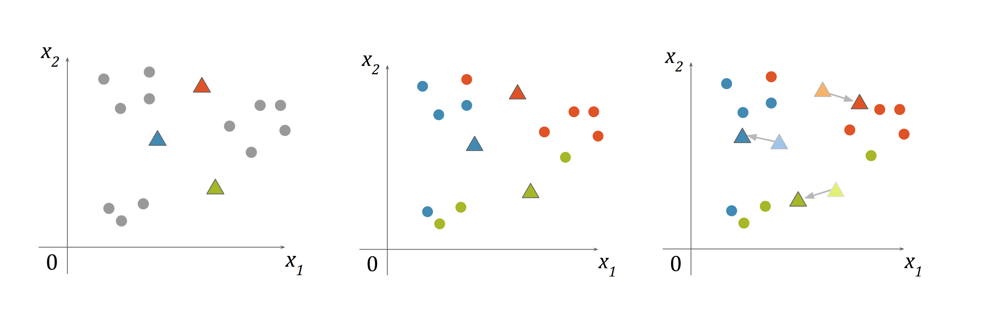
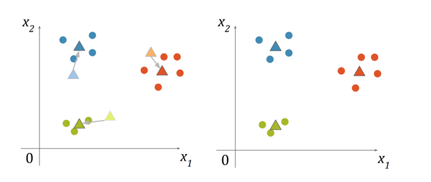
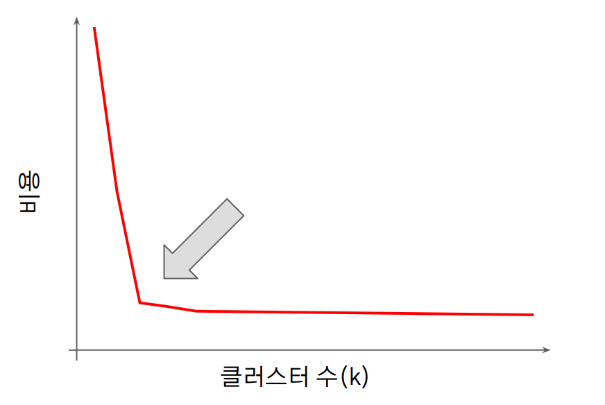

## K-means

 

## 1. 기초 개념

 

- 머신러닝 비지도학습에 속하는 K-means 알고리즘은 데이터를 K개의 군집(Cluster)으로 묶는(Clusting) 알고리즘이다.

- 군집이란 간단히 비슷한 특성을 지닌 데이터들을 모아놓은 그룹이며 군집화는 군집으로 묶는다는 의미로 해석할 수 있다.

- K-means 알고리즘에서 `K`는 묶을 군집(클러스터)의 개수를 의미하고 `means`는 평균을 의미한다. 

- 단어 그대로의 의미를 해석해보면 각 군집의 평균(mean)을 활용하여 K개의 군집으로 묶는다는 의미다. 

- 여기서 `평균(Means)`이란 각 클러스터의 중심과 데이터들의 평균 거리를 의미한다.

  

## 2. 알고리즘 순서

 

- K-Means Clustering 은 Clustering 기법 중 하나이며, K 는 데이터를 몇 개의 클러스터로 분할할지를 의미한다.

- 아래는 K-means의 알고리즘 순서를 나타낸다.

 

① 임의로 k 개의 중심점(centroid)을 생성한다.

② 각각의 데이터를, 가장 가까운 중심점의 클러스터에 포함시킨다.

③ 각 클러스터에 포함된 점들을 평균내어 새로운 중심점을 계산한다.

④ 2번 ~ 3번을 반복하며, 클러스터에 변화가 없으면 종료한다.

 

 

  

## 3. K-means의 특징

 

- 위 과정에서  K-Means 알고리즘은 적절하지 않은 시작 중심점 위치로 인해 지역 최적화(Local Optimum) 에 빠질 수 있다

- 또한, 중심점 초기화 방법에 따라 결과가 달라질 수 있으며, 중심점 초기화 방법은 아래와 같은 방법들이 있다.

- 더불어, K 값 (클러스터 개수) 선택하는 방법도 참고한다.

 

**[ 중심점 초기화 방법 ]**

1. 임의의 벡터로 중심점 초기화
    
   ⇒ 여러번 반복하여 가장 좋은 결과 선택

2. Forgy
    
   ⇒ 데이터 점 들 중 임의로 선택

3. 직접 중심점 지정하기
    
   ⇒ 데이터를 얼추 알고 있을 때 사용

4.  K-Means++

    ⇒ 멀리 떨어진 점들을 초기 중심점으로 사용

 

**[ K 값 (클러스터 개수) 선택하기 ]**

 

- K 값 (클러스터 개수)을 1 부터 증가시켜가며, K 값에 따른 비용을 분석한 뒤, 비용의 감소가 급격히 줄어드는 지점으로 K 를 선택한다.

 

