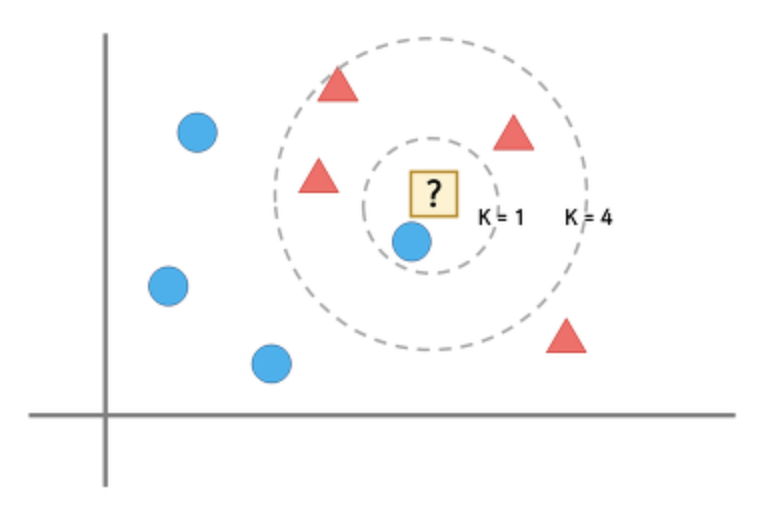

## K-최근접 이웃 (K-NN)

 

## 1. 기초 개념

 

- K-최근접 이웃 (K-Nearest Neighbor) 알고리즘은 지도학습 알고리즘 중 하나다.

- 새로운 데이터를 입력 받았을 때, 해당 데이터와 가장 가까이에 있는 k개의 데이터를 확인해, 새로운 데이터의 특성을 파악하는 방법입니다.

 

- 아래 그래프를 보면 저 물음표에는 세모와 동그라미 중, 무엇이 들어갈까?

  ⇒ 최근접 이웃 알고리즘은 “?”의 주변에 있는 것이 동그라미이기 때문에 “?”를 동그라미라고 판단하는 알고리즘이다.

- 매우 간단하고 직관적인 알고리즘이지만, 단순히 “?”를 가장 가까이 있는 것과 같게 선택하는 것이 옳은 분류가 될까?

  ⇒ 부적절하다.

- 따라서, 단순히 “주변에 가장 가까이 있는게 무엇인가?”가 아닌 “주변에 가장 가깝고, 많이 있는 것이 무엇인가?”라는 방식을 사용한다.

- 이 방식을 “k-최근접 이웃 알고리즘”이라고 부르며, k는 가장 가까이에 있는 데이터의 개수를 의미한다.

- 즉, K가 1일때는 “?” 를 파란 동그라미라고 판단하겠지만 K를 4로 변경한다면 빨간 세모라고 판단할 것이다.

 

  

## 2. K-NN의 특징

 

- K-NN은 데이터 기반 분석 방법입니다. 어떤 점의 특성을 알고 싶다면 가까이 있는 점으로부터 특성 파악이 가능하다.

- 데이터의 분포를 신경쓰지 않는다.

- 회귀문제, 분류문제 등에 적용 가능하다.
    
  ⇒ 회귀 문제는 kNN의 값을 평균 내어 값 예측한다. 분류 문제는 kNN 중에 가장 많은 항목 선택
    
- 가까운 이웃이 여럿일 경우엔?
   
  - 방법 1. 거리에 따라 가중치 주기
    
  - 방법 2. 단독 1등이 나올 때까지 k를 하나씩 줄이기

- 데이터가 균일하지 않을 경우에는 cut-off를 조절하며 사전 데이터가 적은 애들한테 가중치를 준다.

 

### ① K 선택하기

 

- K는 몇으로 설정하는게 좋을까?

- 최선의 K값을 선택하는 것은 데이터마다 다르게 접근해야한다.
    
    - k가 낮다 → 적은 이웃 수로 판단한다 → 불안정한 결과 ~ 오버피팅
    
    - k가 높다 → 많은 이웃 수로 판단한다 → 지나친 일반화 ~ 언더피팅
    
- k를 선택하는 방법 : 가장 좋은 성능을 내는 값으로 선택
    
    - k의 값을 1부터 증가시켜가며 각 점들에 대해 knn으로 분류해보고 오류 계산
    
    - 가장 오류가 적은 k값을 선택하는 것이 최선의 방법이다.

 

### ② 데이터간 거리 구하기

 

- knn은 데이터들 사이의 거리만 측정할 수 있다면 사용 가능하다. 그렇다면, 데이터 간 거리를 구하는 방식은 무엇이 있을까?

- Eucledian Distance ( L2 )

- Manhattan Distance ( L1 )

- Cosine Distance

- Hamming Distance ( 곱집합)

- 자카드거리 ( 집합 )

- 그외
  
    - Standardized Euclidean Distance
    
    - Mahalanobis Distance
    
    - Correlation Distance

  

## 3. K-NN의 장단점

 

**[장점]**

- 쉽고 이해하기 직관적이다.

- 사전 학습이 필요 없다.

- 어떤 분포든 상관 없다. ( 비모수 방식)

- 데이터가 많을 경우 정확도 향상

 

**[단점]**

- 데이터가 많을 경우 연산량 증가
    
    - 차원 축소 등으로 계산량 감소
    
    - 인덱싱으로 탐색 속도 향상
        
        - R-Tree, KD-Tree, KNN-Graph, LSH, etc
    
    - 차원의 저주
        - 데이터의 차원이 증가함에 따라 정확도 급하락

 
