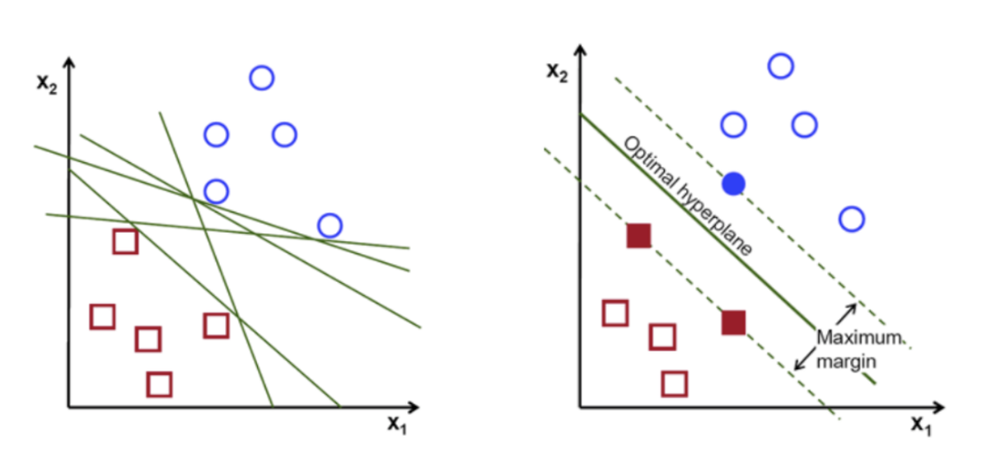

## 서포트 백터머신 (SVM)

 

## 1. 서포트 백터머신(SVM)정의

 

- 분류(classification), 회귀(regression), 특이점 판별(outliers detection) 에 쓰이는 지도 학습 머신 러닝 방법 중 하나이다.

  

## 2. SVM 의 종류

 

- scikit-learn 에서는 다양한 SVM 을 지원한다.

1. SVC : Classification 에 사용되는 SVM 모델을 의미

2. SVR : Regression 에 사용되는 SVM 모델을 의미

3. OneClassSVM : 특이점 판별(outlier detection) 에 사용되는 모델을 의미

 

### ① SVC (Support Vector Classification)

 

- 예를 들어, 아래 그림과 같이 ㅇ과 ㅁ의 두 범주를 나누는 분류 문제를 푼다고 가정해보자.
  
- 구분을 위해 위 그림과 같이 다양한 방법으로 선을 그을 수 있다.

- 만약, 위 그림처럼 두 개의 점선으로 두 그룹을 구분할 수 있다면…

  - 마진 : 두 점선 사이의 거리

  - 최적 초평면 / 결정 경계로 : 마진이 최대값을 가질 때의 중간 경계선

- 따라서, SVM 은 각 그룹이 최대로 떨어질 수 있는 최대 거리(최대마진)를 찾고 , 해당 거리의 중간지점(최적 초평면)으로 각 그룹을 구분짓는 기법이다.
  
- 이와 같은 SVC 는 데이터가 선형인 경우에는 잘 작동하지만, 데이터가 비선형인 경우에는 잘 작동하지 않을 수 있다.

 

